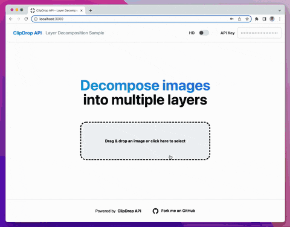
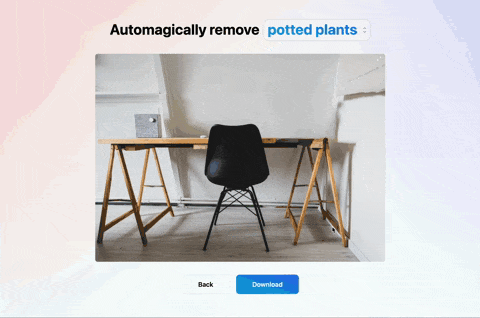
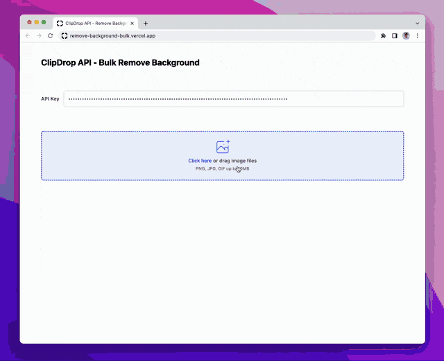

**ClipDrop API Samples**

A collection of open-source samples that demonstrate how to use the ClipDrop APIs on a broad range of applications and platforms.

 

## [web/decompose-layers](web/decompose-layers)

A sample React/Next.js/TailwindCSS app that decomposes images into separate layers.

**⚡️ Live app:** https://clipdrop-api-sample-decompose-layers.vercel.app

## [web/remove-objects-tfjs](web/remove-objects-tfjs)

A sample TensorflowJS/React/Next.js/TailwindCSS app that detects object bounding boxes using CocoSSD and uses ClipDrop API's inpainting to automatically remove the detected objects.

**⚡️ Live app:** https://remove-objects-tfjs.vercel.app

## [web/remove-text](web/remove-text)

A sample Next.js/TailwindCSS app that detects text using the Cloud Vision API and uses ClipDrop API's inpainting to automatically remove the detected texts.

**⚡️ Live app:** https://clipdrop-api-samples-text-remover.vercel.app

## [web/remove-background-bulk](web/remove-background-bulk)

A sample React/Typescript app that allows processing images in bulk.

**⚡️ Live app:** https://remove-background-bulk.vercel.app

## Our tools

ClipDrop API is made with love by [ClipDrop](http://clipdrop.co/). 
Take a look at our other ClipDrop web apps: 
- [Remove background](https://clipdrop.co/remove-background)
- [Cleanup](https://clipdrop.co/cleanup)
- [Image Upscaler](https://clipdrop.co/image-upscaler)
- [Relight](https://clipdrop.co/relight)

Our [Cleanup.pictures](https://cleanup.pictures/) website 
